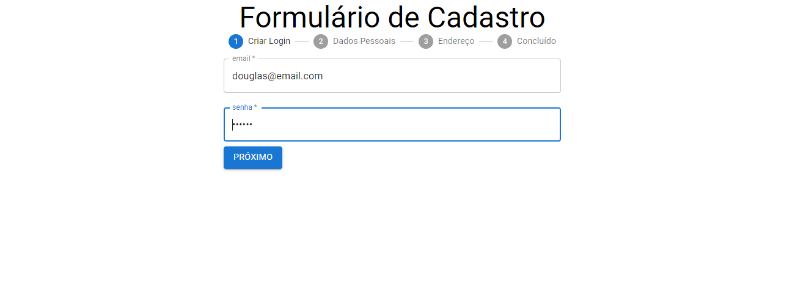
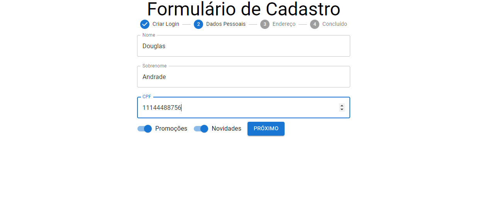
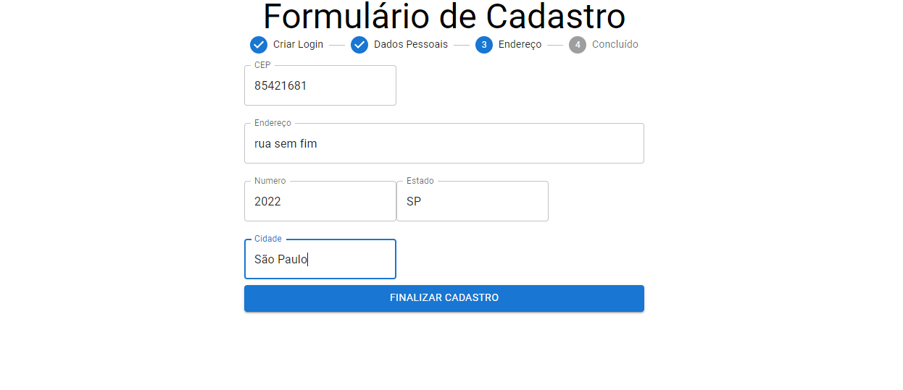
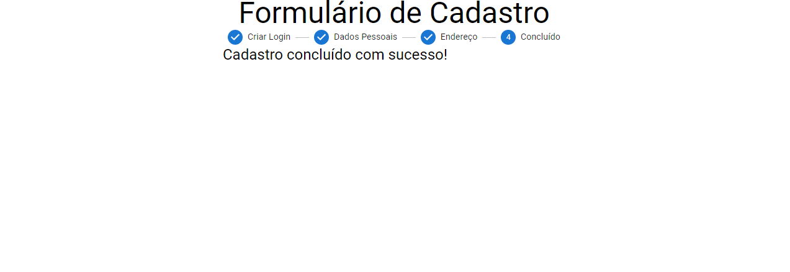

# Formulário de cadastro usando Reactjs

Projeto consiste em um formulário de cadastro de clientes.








## Como executar a aplicação 


- Caso não tenha instalado no seu terminal o pacote npm, execute o seguinte comando:

```

 npm install

```

- Navegar até a pasta executando:

```

 cd ./project

```

- Executar o projeto através do comando npm start:

```

npm start

```

## Motivação

Projeto com fins de estudo, utilizando o framework React e Material UI na estilização do projeto . 

## Tecnologias Utilizadas

- React
- HTML
- Material UI
- CSS
- Visual Studio Code

## Autor

- Douglas Andrade dos Santos
